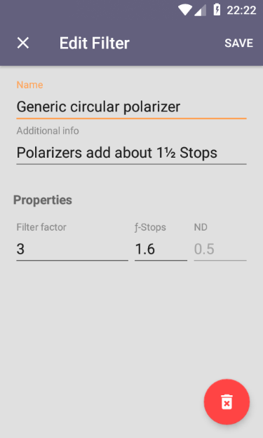
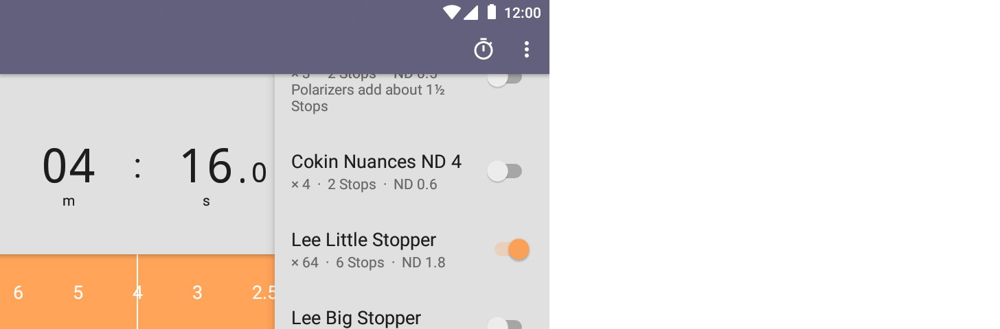

# NDx

Exposure time calculator for when using ND filter(s). Written in Kotlin. For Android.

### Features

* Beautiful and fast user interface
* High precision calculation
* Combine (_stack_) as many filters as you like
* Create your own filters
* Includes a handy timer
* Customizable EV step size: full, half or third
* Comes with a pre-defined filter set 

### Screenshots

#### Three different themes

#### Timer & Filter Editor

#### Landscape layout

## License

Copyright (C) 2018 Maximilian Salomon

This program is free software: you can redistribute it and/or modify
it under the terms of the GNU General Public License as published by
the Free Software Foundation, either version 3 of the License, or
(at your option) any later version.

This program is distributed in the hope that it will be useful,
but WITHOUT ANY WARRANTY; without even the implied warranty of
MERCHANTABILITY or FITNESS FOR A PARTICULAR PURPOSE.  See the
GNU General Public License for more details.

You should have received a copy of the GNU General Public License
along with this program.  If not, see <http://www.gnu.org/licenses/>.
