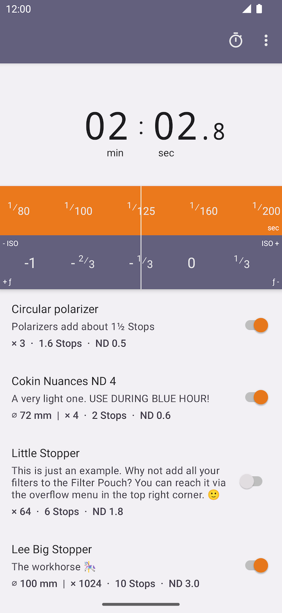

# NDx

   
   
A photography exposure time calculator for ND filters. For Android.

   

## Features

* Beautiful and fast user interface
* High precision calculation
* Combine (*stack*) as many filters as you like
* Create your own filters
* Filter calibrator included
* Comes with a handy timer
* Customizable EV step size: full, half or third

## Screenshots

### Three different themes

   
   
   

### Timer, Filter Editor & Filter Calibrator

   
   
   

## License

Copyright (C) 2021 Maximilian Salomon
